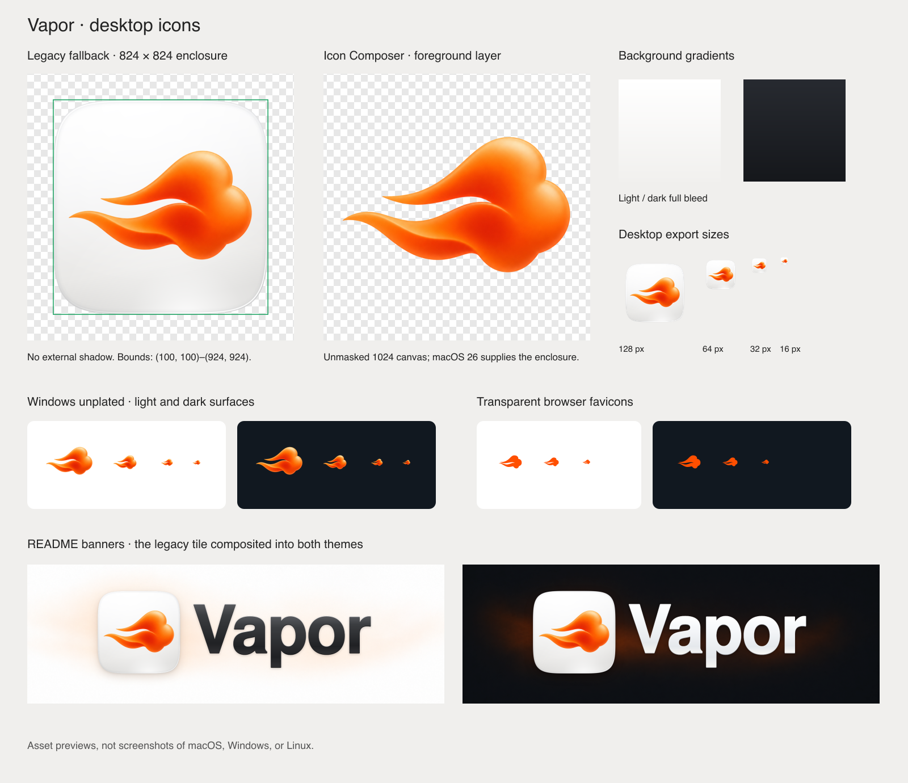

# assets

Source of truth for everything Vapor ships that is not code: the brand
artwork for each surface and the user-facing copy catalogs. Build scripts
copy from here into the app bundles; nothing under `apps/` or `core/` holds
its own copy of these files.



## Layout

| Path | What it holds | Consumed by |
| --- | --- | --- |
| `locales/*.json` | UI copy catalogs, one per language | `scripts/swift/resources.sh` mirrors them into the macOS app (`AGENTS.md` §8.7) |
| `macos/Vapor.icon/` | The Icon Composer document: the sculpture as one layer over a porcelain gradient, with a dark gradient for the dark appearance | `apps/macos/scripts/package.sh` compiles it with `actool` into the bundle's asset catalog; macOS 26 renders it |
| `macos/Vapor.iconset/` | The flat fallback icon in the ten Apple-named slots, 16 to 1024 px | `package.sh` packs them into `Vapor.icns` with `iconutil` |
| `macos/menubar/` | The status item mark: an editable 22 × 18 SVG, black template PNGs at 1x, 2x, 3x, and white previews | `scripts/swift/resources.sh` mirrors the 1x and 2x template PNGs into the macOS app |
| `windows/` | `Vapor.ico` and `Vapor-unplated.ico` (15 sizes each), the same sizes as PNGs plus 512 and 1024, tray glyphs in black and white, and the MSIX asset family with its manifest fragment | The Windows app, when it ships |
| `linux/` | A freedesktop `hicolor/` tree (12 raster sizes, a scalable flat SVG, a symbolic SVG), a desktop entry, and an icon install script | The Linux app, when it ships |
| `marks/` | The flat vapor mark as SVG in black, white, and brand orange | Favicons, tray glyphs, the Linux vector fallback, anything that needs the symbol without the tile |
| `github/` | The README banners (1800 × 600 PNG, light and dark) and the repository social previews (1280 × 640 JPEG) | The root `README.md`; the repository's social preview setting |
| `web/` | The landing site's `public/` tree (favicons, touch and Android icons, web manifest, Open Graph and Twitter cards) and the `head.html` metadata snippet | The future landing site at `vapor.arn.sh` |
| `source/` | Reproduction and provenance: the 1024 masters every icon derives from, the atmosphere plates and vector wordmark the banners are composed from, the two contact sheets, the prompts, and the rebuild tools | Regenerating or extending the set |

## Identity

The app icon is a sculpted orange vapor trail on a porcelain rounded
square. The menu bar, the favicons, and the tray glyphs use a flat
monochrome redraw of the same trail. The banners pair the icon with a bold
sculpted `Vapor` wordmark over a faint warm haze.

| Role | Value |
| --- | --- |
| Brand orange (Aerospace International Orange) | `#FF4F00` |
| Light tile gradient | `#FFFFFF` to `#F1F0EE` (solid alternative `#FAF9F7`) |
| Dark tile gradient | `#272A30` to `#15171B` (solid alternative `#17191D`) |
| Light page surface | `#FAF9F7` |
| Dark page surface | `#0D1117` |

The rendered sculpture and the banners shade around the brand orange; the
SVG marks and favicons use it flat.

## macOS

**Icon Composer document.** `macos/Vapor.icon/` is what macOS 26 shows in
the Dock, Finder, and Launchpad. `icon.json` places one layer, the isolated
sculpture (`Assets/vapor-sculpted.png`, 1024 px, straight alpha, no tile
and no baked-in shadow), over a full-bleed porcelain gradient, with the
dark gradient declared for the dark appearance. Liquid Glass is off on the
layer because the raster already carries its own shading. The system
supplies the enclosure, the glass edge, and the tinted and clear variants.

`package.sh` compiles the document with `actool` into
`Contents/Resources/Assets.car` and sets `CFBundleIconName` in the
Info.plist. Open the document in Icon Composer (in Xcode's Applications
folder) to adjust the fills, shadow, or appearance annotations; it rewrites
`icon.json` on save, and the packaging picks the change up on the next
build. A legacy icon that does not fill Apple's rounded square gets boxed
inside a system tile on macOS 26, which is what the layered document
avoids.

**Flat fallback.** `macos/Vapor.iconset/` holds the same sculpture on a
porcelain tile with soft edge shading and rim highlights, cut to an 824 px
enclosure on the 1024 canvas. The enclosure is one analytic superellipse
(exponent 5, approximated by 128 tangent-matched cubic segments, within a
hundredth of a pixel of the curve and symmetric on both axes and both
diagonals; the 185 px corner figure is an optical reference, not a radius)
with nothing outside it. It is an optical stand-in for Apple's mask, not
an export of it. `package.sh` checks that all ten slots exist at their
pixel size and packs them into `Vapor.icns` for anything that still reads
`CFBundleIconFile`. The 1024 px master is the `icon_512x512@2x.png` slot;
there is no separate copy.

**Menu bar.** The status item shows `VaporMenuBarTemplate.png` and its
`@2x` sibling. The resource sync copies both to the root of the macOS
app's resource bundle, and the app loads them by name through
`MenuBarIcon` (`apps/macos/Sources/Vapor/MenuBarIcon.swift`). AppKit pairs
the two scales into one image and, because the name ends in `Template`,
tints it for the current menu bar appearance; the app never picks a
colour. The `@3x` file and the white PNGs are previews and are not
shipped, since macOS renders at 1x and 2x only.

The template PNGs carry 72, 144, and 216 dpi so they load at 22 × 18
points. Re-export them with the same values; a file tagged at a higher
density loads at a fraction of its intended size.

## Windows

`windows/Vapor.ico` is the plated tile for a conventional executable icon
(`Vapor.rc` embeds it as resource 101); `Vapor-unplated.ico` is the
sculpture alone on transparency for a lighter shell appearance. Both hold
16, 20, 24, 30, 32, 36, 40, 48, 60, 64, 72, 80, 96, 128, and 256 px, the
frames below 256 as 32-bit DIBs with alpha and AND masks, the 256 frame as
PNG. `png/` and `unplated/` hold the same sizes plus 512 and 1024 as
standalone PNGs. `tray/` holds the flat mark in black and white at 16, 20,
24, 32, 40, 48, and 64 px for the notification area; pick the tint for the
actual tray theme in the app.

`msix/Assets/` is the packaged-app family after Microsoft's icon
construction guide: AppList target sizes at 16 to 256 px in default,
`altform-unplated`, and `altform-lightunplated` forms (all unplated, since
the mark reads on both surfaces), plus AppList, SmallTile, MedTile,
WideTile, LargeTile, StoreLogo, and SplashScreen at 100 to 400 percent
scale with light-theme variants. `msix/VisualElements.xml` is a fragment
for the package manifest's `Application` element; it deliberately omits
identity, executable, and capabilities, and `Package/Properties/Logo` is
`Assets\StoreLogo.png`. None of this has been compiled into a Windows
package yet.

## Linux

`linux/hicolor/` follows the freedesktop icon theme layout:
`<size>x<size>/apps/vapor.png` at 16, 22, 24, 32, 48, 64, 96, 128, 192,
256, 512, and 1024 px (the sculpture on the light tile),
`scalable/apps/vapor.svg` (the flat mark on the tile; it does not
reproduce the sculpture), and `symbolic/apps/vapor-symbolic.svg`.
`linux/vapor.desktop` is the launcher entry with `Icon=vapor` and
`Exec=vapor`; point `Exec` at the installed binary when packaging.
`linux/install-icons.sh [prefix]` copies the tree under
`<prefix>/share/icons/` (default `~/.local`) and refreshes the GTK icon
cache when one exists; it installs artwork only. AppImage packagers can
use the 256 or 512 px PNG as `.DirIcon`. Nothing here has been installed
on a desktop yet.

## GitHub

The root `README.md` opens with a `<picture>` block that serves
`github/vapor-banner-dark.png` or `github/vapor-banner-light.png` to match
the viewer's theme, with the light file as the fallback for renderers that
ignore media queries. Both banners and all six social cards are composed
by the rebuild tool: the legacy tile with a soft contact shadow, the
`Vapor` wordmark as vector outlines (Nimbus Sans Bold with tightened
spacing and a small rounded weight expansion, so no font needs to be
installed), and one-pixel edge highlights, over a generated atmosphere
plate per theme.

The repository social preview is a single image chosen by hand: upload
`github/vapor-social-dark-1280x640.jpg` (or the light file) under
Settings → General → Social preview. It does not follow the viewer's theme,
and the README block has no effect on it.

## Web

Copy `web/public/` to the landing site's public directory as is, keeping
the `social/` subfolder, and add `web/head.html` to the page head or
translate it into the framework's metadata API. The snippet already points
at `https://vapor.arn.sh`; adjust the paths and the manifest `start_url` if
the site ever lives under a subdirectory.

The metadata selects the dark Open Graph and card images. Open Graph has
no theme mechanism, so the light files are alternatives to swap in by
editing the two filenames and their `alt` text, not automatic variants.
The favicons (SVG, ICO, and the 16, 32, 48 px PNGs) are the orange mark on
true transparency; the touch and Android icons are the full-bleed light
composition, since those platforms apply their own corner mask. The
manifest lists normal-purpose icons only and does not on its own make the
site installable.

## Sources and rebuilding

Two masters produce every icon export: `source/masters/vapor-foreground-1024.png`
(the sculpture, isolated from the original render with straight alpha)
and `marks/vapor-mark-orange.svg` (the flat mark). The tile material and
the enclosure curve are code, in `source/tools/surface.cjs`. The rest of
`masters/` is derived and kept for reference: the mono and flat-orange
variants of the sculpture, the light and dark background gradients and
their `background-colors.json`, the full-bleed compositions, the dark
legacy tile, the legacy mask as SVG and PNG, `geometry.json`, and the
curve measurements in `curve-validation.json`.

The banners and social cards come from `source/marketing/`: two
atmosphere plates (the earlier generated banners with their icon and
lettering removed by an edit pass) and the wordmark as glyph outlines in
`wordmark-paths.json` (with `vapor-wordmark.svg` for reference).

The tools regenerate everything except the two hand exports, the menu bar
template and the browser favicons:

```sh
cd assets/source/tools
npm install
npm run build       # icons, banners and cards, contact sheets
npm run validate    # curve continuity, then every export and reference
```

`npm run icons`, `marketing`, and `previews` run the three steps alone.
Node and the pinned `sharp` are the only build dependency; the validator
needs Pillow and NumPy. A rebuild on a different CPU can move a few
samples by one level, which is rounding in the resampler, not a design
change. To cut the legacy tile with SwiftUI's own continuous-corner mask
instead of the superellipse, run `swift source/tools/render-system-mask.swift`
from this directory first; the rebuild uses
`masters/macos-system-mask-1024.png` when it exists. Changing the
typography means editing `source/tools/build-wordmark.py`, which needs
FontTools and a local copy of Nimbus Sans Bold (`VAPOR_WORDMARK_FONT`);
its output is committed, so nobody else needs the font.

The prompts that produced every generated raster are in
`source/GENERATION-NOTES.md`.

## Rules

- Edit files here. The copies under `apps/macos/Sources/VaporCore/Resources/`
  are generated, gitignored, and overwritten on every build, test, and
  package run.
- Keep the platform-facing names exactly as they are: the iconset slot
  names are what `iconutil` expects, the `Template` suffix is what makes
  the menu bar mark a template image, the MSIX qualifiers are how Windows
  resolves a size, and the hicolor paths are how a Linux desktop finds an
  icon.
- A change to the sculpture goes into the foreground master, a change to
  the tile or the wordmark into the tools or `source/marketing/`, and then
  through the rebuild and the validator, so every platform stays in step.
- A new raster joins the set with its prompt in `source/GENERATION-NOTES.md`.
